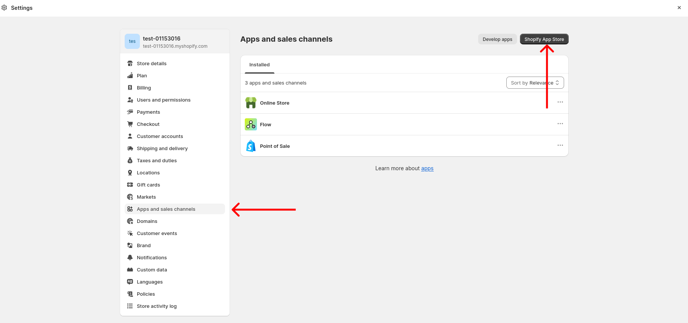
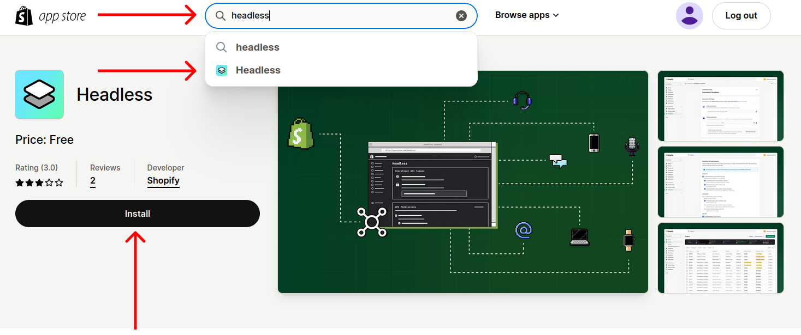
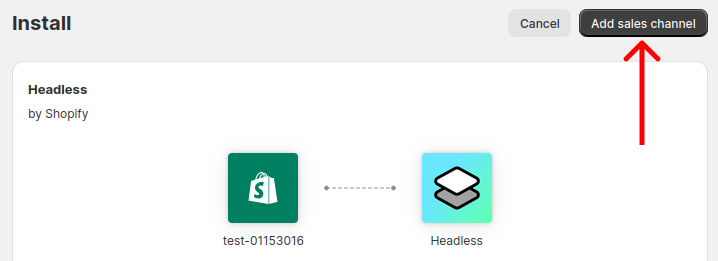
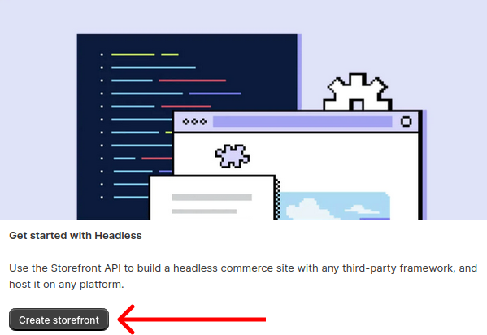
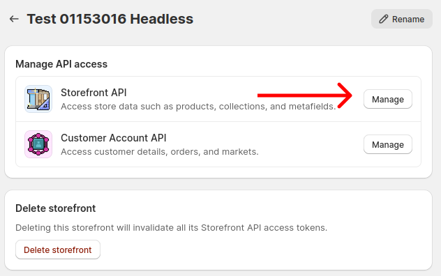
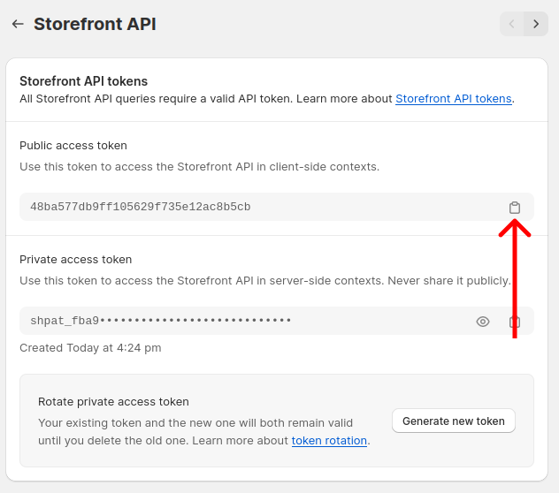
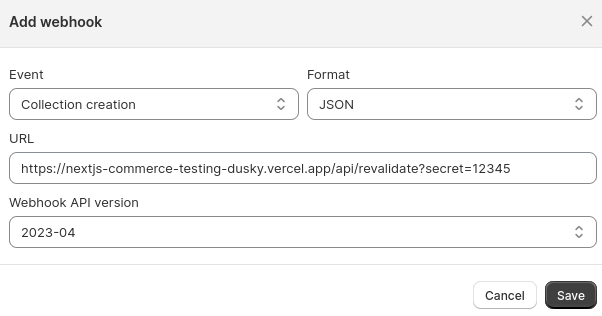
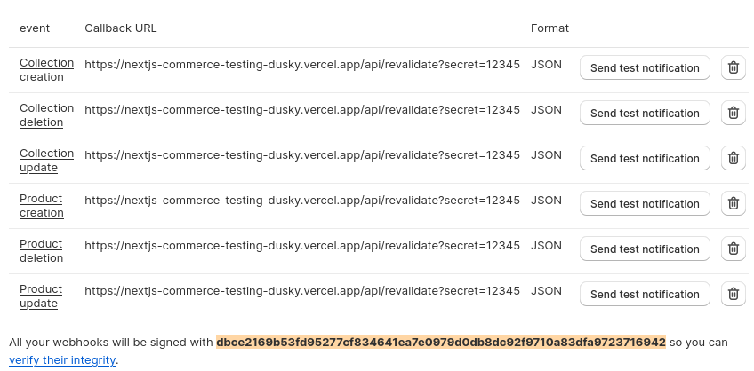

## 5. Install the Shopify Headless app

1. From settings navigate to `Apps and sales channels` and select `Shopify App Store`

   

2. On the apps page search `headless` and `install` it

   

3. On next screen select `add sales channel`

   

4. When app is installed a new window will open, select `create storefront` from there

   

5. Click `manage` on storefront api and select the `Public access token`. Save this at some place it is to be used while deployment

   

   

6. Almost all the things for initial deployment are ready. Create some token by navigating to [Online GUID Generator](https://www.uuidgenerator.net/guid) and save it some where. It will be used as revalidation token.

---

## 6. Deploy the app on vercel

1. Open [Next.js Commerce](https://vercel.com/templates/next.js/nextjs-commerce)

2. Click `deploy`

3. Create Git Repository

4. Configure Project by setting env variables. Example as follows use your own values.

   ```env
   SHOPIFY_STOREFRONT_ACCESS_TOKEN=48ba577db9ff105629f735e12ac8b5cb
   SHOPIFY_STORE_DOMAIN=https://test-01153016.myshopify.com
   TWITTER_CREATOR=@vercel
   TWITTER_SITE=https://nextjs.org/commerce
   SITE_NAME=Next.js Commerce
   SHOPIFY_REVALIDATION_SECRET=12345
   COMPANY_NAME=Vercel Inc.
   ```

5. Deploy and get deployed URL from there.

## 7. Add Webhooks

1. From settings navigate to notification and scroll to the bottom of the page and select create webhooks. `settings` --> `notifications` --> `create webhooks`

2. Fill out the form as follows. Don't forget to use your own values

   

3. Now add hooks for the following too.

   - collection deletion
   - collection update
   - product creation
   - product deletion
   - product update

4. Complete webhook list

   

## 7. Create collections

1. Navigate to products section, select collections from there and click add collection button.

   

https://nextjs-commerce-testing-dusky.vercel.app/api/revalidate?secret=12345
