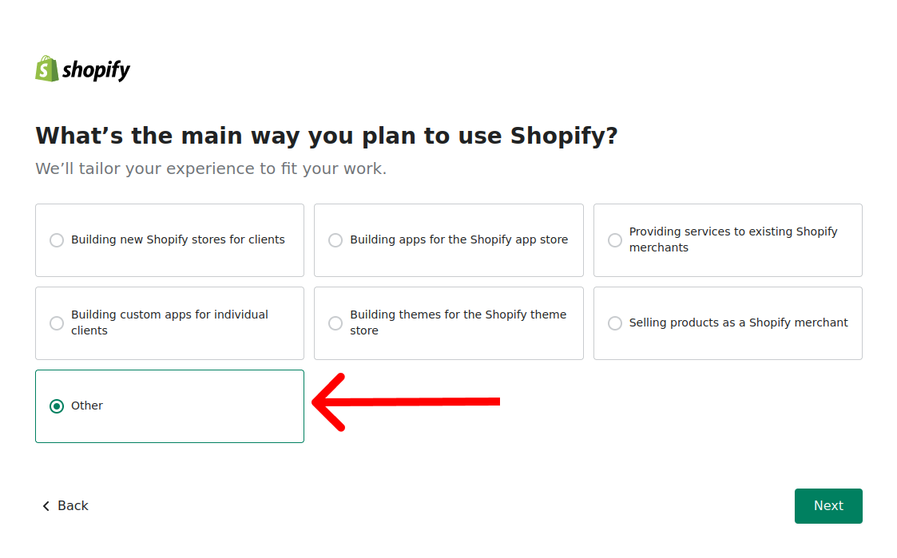
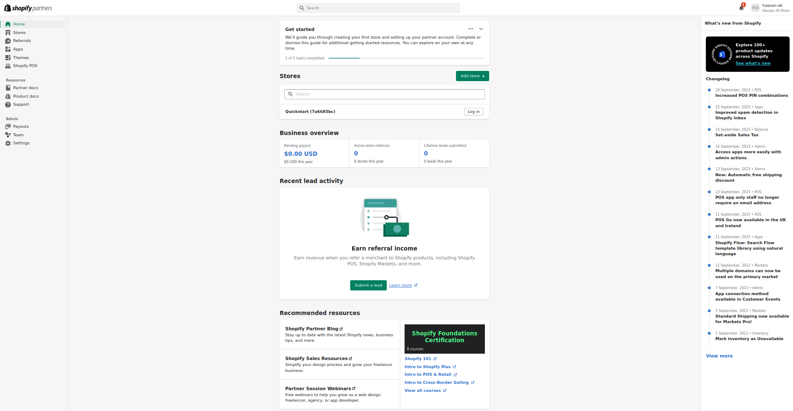
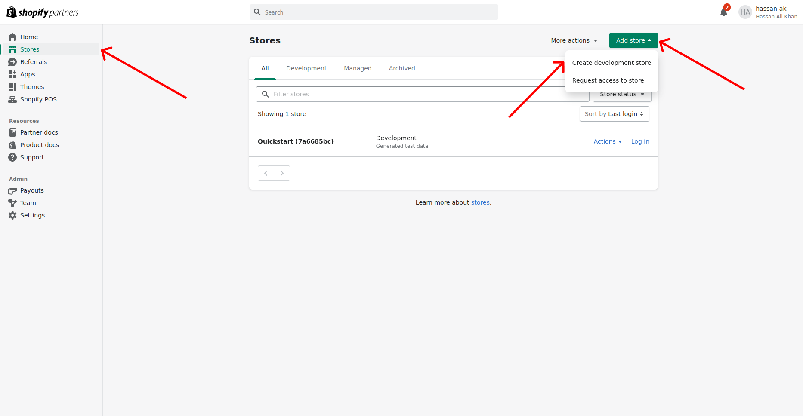
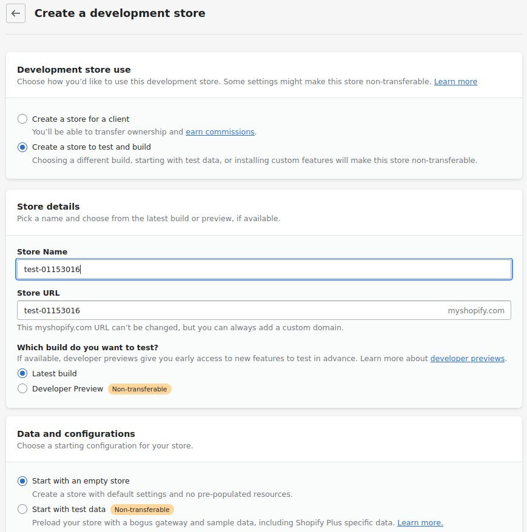
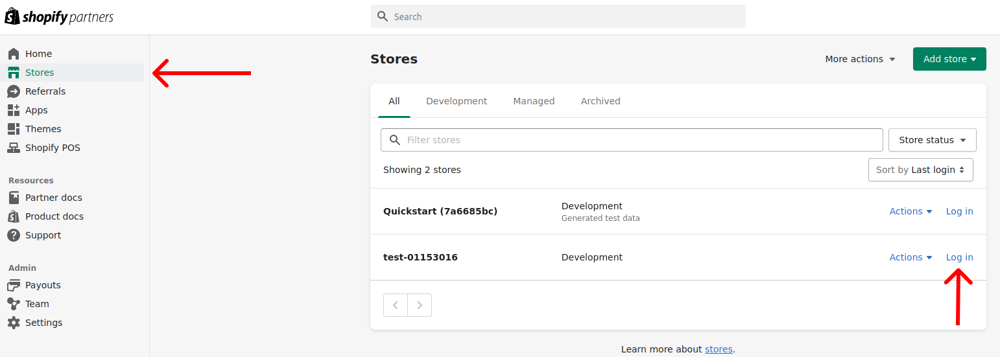
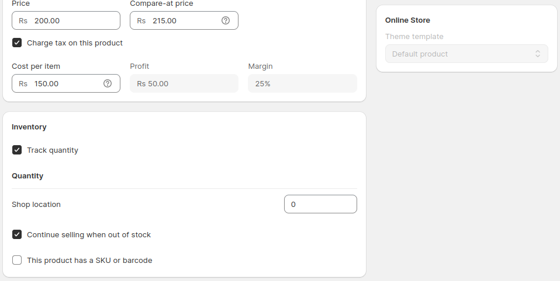
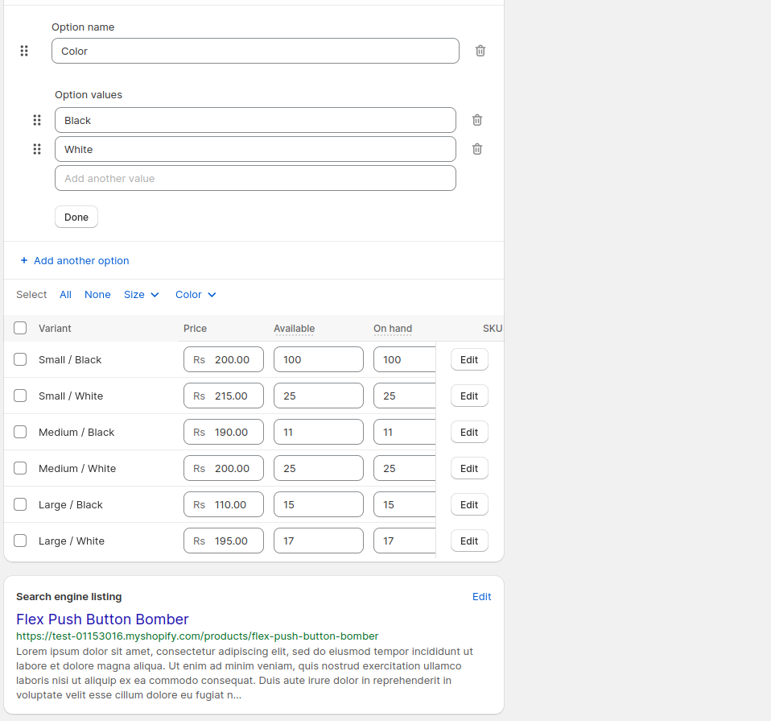
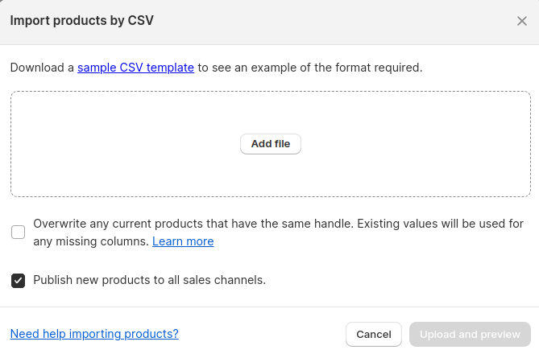
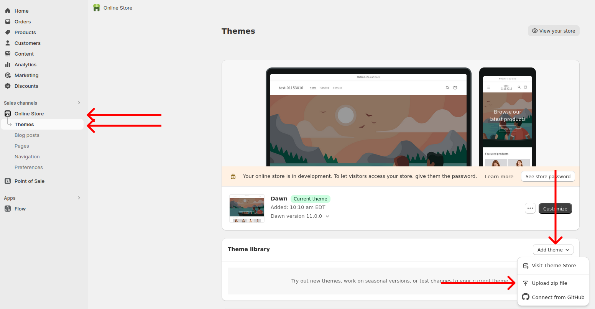
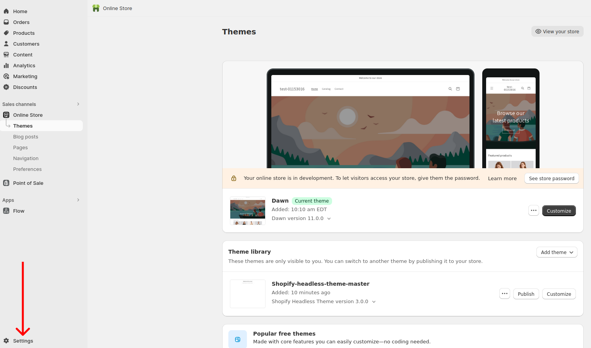

# Vercel shopify e-commerce Integration guide

- [Vercel and Shopify Integration](https://vercel.com/docs/integrations/shopify)

## 1. Create shopify partners account

1. SignUp at [Shopify Partners](https://www.shopify.com/shopifypartnersvap?gclid=CjwKCAjwjaWoBhAmEiwAXz8DBQ0UJ8T6ens8l2IY9tTq5rozv4gJkDtWkfLdRamd8sOyljgOgl2tXxoCGfMQAvD_BwE)

2. Select `others` as reason to use shopify

   

3. Set business location

   

4. Set business contact information

   

   

5. Submitting this form will open the shopify partners dashboard

   

## 2. Create shopify storefront

1. On shopify partners dashboard select `Stores` from the left sidebar, open dropdown menu by selecting `Add store` and select `Create development store`.

   

2. Enter details for the new store and create development store.

   

3. Creating new store will navigate to storefront dashboard. If you are not navigated bt default, select `Stores` from the left sidebar of shopify partners dashboard and `login` to the newly created store

   

4. After successful login to the newly created storefront you will be navigated to storefront dashboard.

## 3. Add products

1. On storefront dashboard select `Products` from the left sidebar and then select `Add Your Products`.

   

2. Add Products details

   

   

   

   

3. You can add products one by one or you can import from a csv file. Download [this csv file](./asserts/products.csv) and on the products page select `import`. This will open a dialog box.

   

4. Select `add file` and select the downloaded file.

   

5. Don't forget to select all options. Select `update and preview` and then `import products`

   

## 4. Install and customize Shopify Headless theme

1. Download [Shopify Headless theme](https://github.com/instantcommerce/shopify-headless-theme/archive/refs/heads/master.zip)

2. Select `Online Store` from the sidebar and select `Themes`. Open dropdown menu by clicking `Add theme` and select `upload zip file` and select the downloaded file.

   

3. From the bottom left of the storefront dashboard click settings

   

4. from the top left corner copy the storefront url. Save it some where as we need it again for deployment

   

5. When theme is uploaded select `customize`

   

6. Click `Theme settings` (the paintbrush icon), expand the `STOREFRONT section`, enter your `headless store domain` you copied in `step 04``

   

7. (Optional) No, expand the `FAVICON section`, and select the icon image you want

   

8. From the top right corner save and publish the theme

   

9. (Optional) From the settings we opened in `step 3` you can customize the checkout page. To make changes to checkout page `settings` --> `checkout` --> `customize checkout`. On this page you can

   - set banner image
   - set site logo on banner
   - set styling for main content area
   - set styling for order summary

10. (Optional) From the settings we opened in `step 3` you can customize the branding. To make changes to checkout page `settings` --> `brand`.

11. (Optional) From the settings we opened in `step 3` you can customize the email too. To make changes to checkout page `settings` --> `notifications` --> `customize email templates`.

## 5. Install the Shopify Headless app

1. From settings navigate to `Apps and sales channels` and select `Shopify App Store`

   

2. On the apps page search `headless` and `install` it

   

3. On next screen select `add sales channel`

   

4. When app is installed a new window will open, select `create storefront` from there

   

5. Click `manage` on storefront api and select the `Public access token`. Save this at some place it is to be used while deployment

   

   

6. Almost all the things for initial deployment are ready. Create some token by navigating to [Online GUID Generator](https://www.uuidgenerator.net/guid) and save it some where. It will be used as revalidation token.

## 6. Deploy the app on vercel

1. Open [Next.js Commerce](https://vercel.com/templates/next.js/nextjs-commerce)

2. Click `deploy`

3. Create Git Repository

4. Configure Project by setting env variables. Example as follows use your own values.

   ```env
   SHOPIFY_STOREFRONT_ACCESS_TOKEN=48ba577db9ff105629f735e12ac8b5cb
   SHOPIFY_STORE_DOMAIN=https://test-01153016.myshopify.com
   TWITTER_CREATOR=@vercel
   TWITTER_SITE=https://nextjs.org/commerce
   SITE_NAME=Next.js Commerce
   SHOPIFY_REVALIDATION_SECRET=12345
   COMPANY_NAME=Vercel Inc.
   ```

5. Deploy and get deployed URL from there.

## 7. Add Webhooks

1. From settings navigate to notification and scroll to the bottom of the page and select create webhooks. `settings` --> `notifications` --> `create webhooks`

2. Fill out the form as follows. Don't forget to use your own values

   

3. Now add hooks for the following too.

   - collection deletion
   - collection update
   - product creation
   - product deletion
   - product update

4. Complete webhook list

   

## 8. Create collections

1. Navigate to `products` section, select `collections` from there and click `add collection` button.

   

2. Delete already created collections if any.

3. Create a collection with following properties.

   

4. All the others collections should follow this table

| Sr. No. | Collection Name                 | Condition |
| ------- | ------------------------------- | --------- |
| 1       | Hidden: Homepage Featured Items | features  |
| 2       | Hidden: Homepage Carousel       | cross     |
| 3       | Female                          | Female    |
| 4       | Male                            | Male      |
| 5       | Kids                            | Kids      |

5. With collections added you can navigate to deployed link and can see the updated home page

## 9. Create Pages

1. From `online store` select `pages` and click `add page` button

   

2. Add page details as follows

   

3. Create other pages with the following name. You can write content of the page as your choice, for sample content open respective link and use page content from there

| Sr. No. | Collection Name                                                              |
| ------- | ---------------------------------------------------------------------------- |
| 1       | [About](https://demo.vercel.store/about)                                     |
| 2       | [Frequently Asked Questions](https://demo.vercel.store/terms-conditions)     |
| 3       | [Privacy Policy](https://demo.vercel.store/privacy-policy)                   |
| 4       | [Shipping & Return Policy](https://demo.vercel.store/shipping-return-policy) |
| 5       | [Terms & Conditions](https://demo.vercel.store/frequently-asked-questions)   |

## 9. Add Navigation

1. From `online store` select `navigation` and update `Footer menu` and `Main menu` one by one by removing added items in them.,

   

2. Now click `add menu` and name it `Next.js Frontend Footer Menu` and fill out the form

   

3. Name and link for `Next.js Frontend Footer Menu` items is as per following table

| Sr. No. | Item Name                | Item Link                  |
| ------- | ------------------------ | -------------------------- |
| 1       | Home                     | Home page                  |
| 2       | About                    | About                      |
| 3       | Terms & Conditions       | Terms & Conditions         |
| 4       | Shipping & Return Policy | Shipping & Return Policy   |
| 5       | Privacy Policy           | Privacy Policy             |
| 6       | FAQ                      | Frequently Asked Questions |

4. Click `add menu` and name it `Next.js Frontend Header Menu` and fill out the form

5. Name and link for `Next.js Frontend Header Menu` items is as per following table

| Sr. No. | Item Name | Item Link |
| ------- | --------- | --------- |
| 1       | Products  | Search    |
| 2       | Male      | Male      |
| 3       | Female    | Female    |
| 4       | Kids      | Kids      |

## 10. Check Deployment

1. If every step is followed correctly your deployed site will look like this https://nextjs-commerce-five-jet.vercel.app/

2. In case your deployed site have some missing features redeploy it

## 11. Install and configure ngrok

1. SignUp at [ngrok](https://dashboard.ngrok.com/signup)
2. On the left side bar select `your authtoken` and get your token from there
3. On the left side bar select `setup and installation` and download ngrok then install it.
4. configure using `ngrok config add-authtoken <token>`

## 12. Run locally

1. Clone the repository from your github
2. `vercel link` to link the repository with the deployed project
3. `vercel env pull` to pull env variables from the vercel dashboard
4. Update `package.json` and change next version from `13.4.13-canary.15` to `13.5.1` (for windows users if it gives some error use `13.4.6`)
5. `pnpm install` to install dependencies. If you don't have `pnpm` installed, install using `npm i -g pnpm`
6. `pnpm dev` to run locally
7. `ngrok http 3000` in a new tab to test webhooks locally. This will give a Forwarding url. Add this url to webhook to test them locally. The same we have done in `section 7`
8. Play with collections or products to test if webhooks work locally.
9. Make changes to the home page
10. Deploy locally or from github
